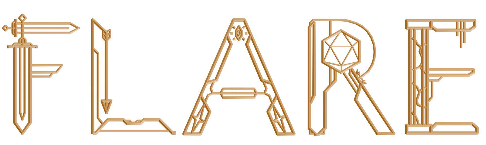
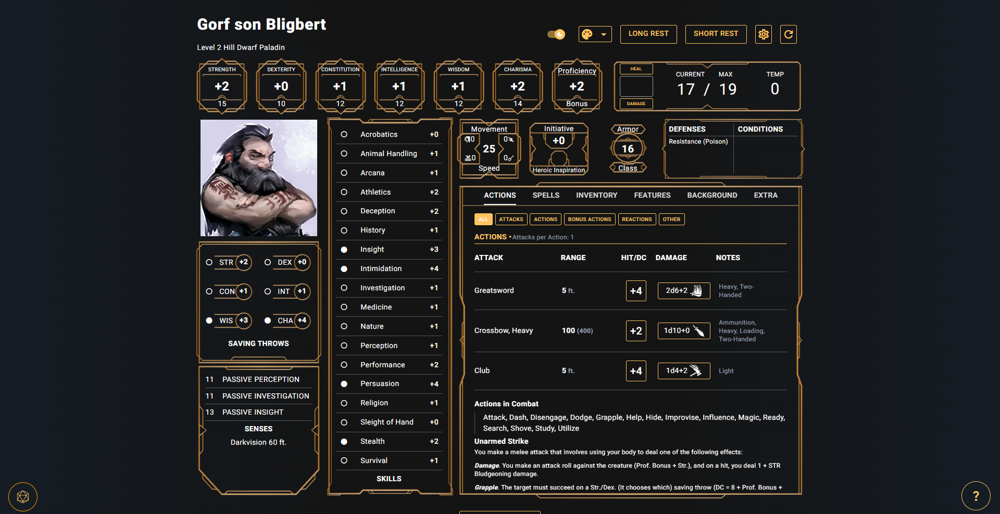
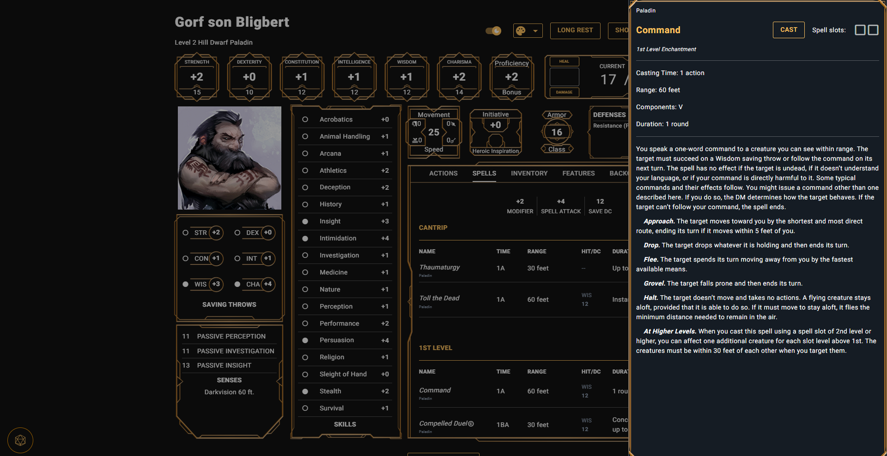
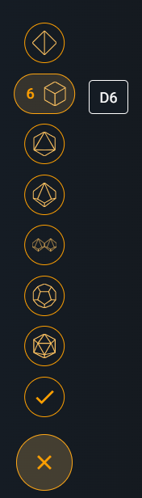
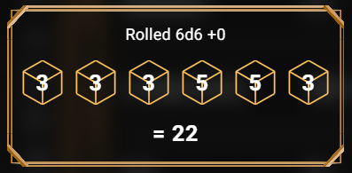
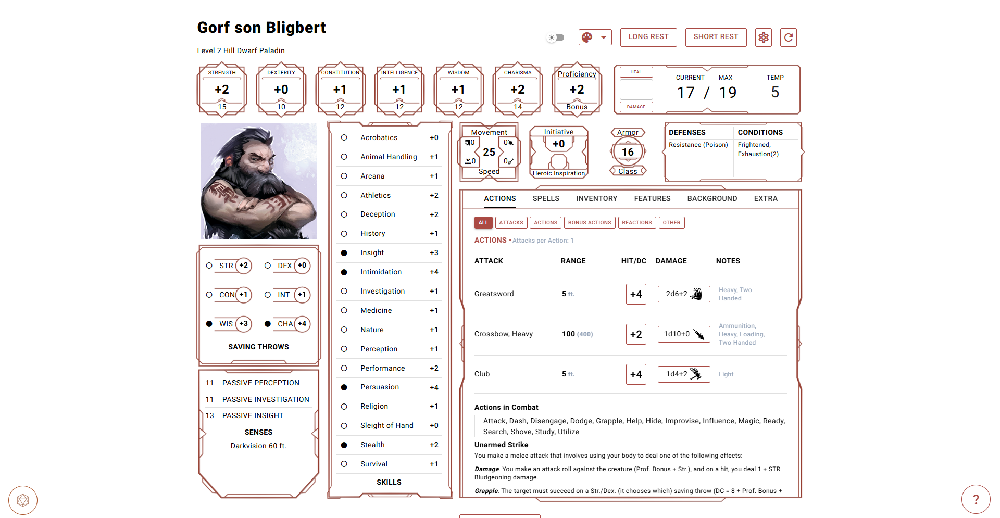
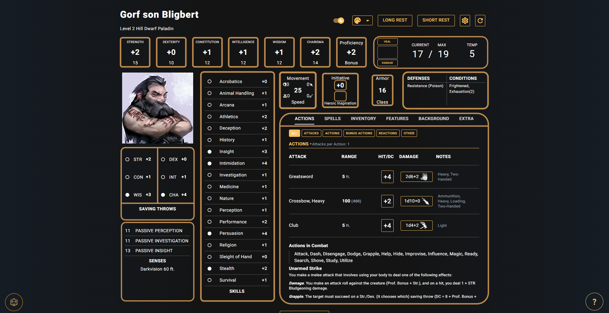

# What is Flare

Flare is a third party companion to the [Aurora Character Builder](https://aurorabuilder.com) that I made to view and track characters made with Aurora in a more user friendly way.

Flare is **not** a replacement for Aurora, you'll still need to build your characters separately, but Flare syncs with any changes you make and provides you with a nice UI and utilities to interact with your character during a session.

# :page_with_curl: Features
## :busts_in_silhouette: Easy Character Loading
Flare loads your character with just a few clicks and gives you access to everything you need to play. You can save any number of characters for future access, all of which will stay up to date with any changes you make in Aurora.

You can also view the details of you character's spells, items, and features seamlessly within the app.

## :ballot_box_with_check: Resource Tracking
Flare makes it easy to keep track of Hitpoints, Hitdice, Spell Slots, Feature Charges, Inspiration, Conditions, Currency, and more.

Your character will automatically regain relevant resources when peforming Short and Long Rests.

## :game_die: Dice Rolling
Physical dice are great but sometimes you don't want to hold up the game by calculating 8d6. Within Flare you can quickly roll custom dice combinations, attacks, damage, saves, and skill checks.

You can also automatically roll checks, saves, and attacks with advantage or disadvantage to make things that much faster.

Custom Dice Selection             |  Roll Result
:-------------------------:|:-------------------------:
  |  

## :art: Customization
Match your character's look with different color schemes as well as custom colors, dark mode, and different backgrounds.

You can also customize the frames from one of the packaged sets, or design your own!

# :memo: How to Use
Flare requires Aurora to be installed to work.

Navigate to the releases and use the latest installer to set up Flare.

After installing and opening Flare for the first time, navigate to the Settings and set the Content Directory to point to the folder where Aurora stores content files. In most cases this will be the "custom" subfolder of "5e Character Builder".

Once the content folder is set up you are free to add characters, simply press "Load Character" in the main screen and navigate to your Aurora character file (sometimes the dialog may appear hidden and you need to find it with alt+tab). Selecting this file will open it and save it for future access. If you edit the character file in Aurora in the future and refresh the page in Flare, the changes will be reflected.

That's it, you're ready to play!

# :gear: Further Customization
If the built-in customization options aren't enough, you can add more color schemes and frame sets to Flare.

To add more colors navigate to the `colors.json` file in `Flare/data/saves` where `Flare` is the installation location (`AppData/Local/Programs/Flare` by default). The color schemes are defined in this `.json` file with a name, primary color in hex, and frame color in HSV. By adding new elements with these components, they will automatically appear in Flare after restarting.

To add custom frame sets, find the frame folders in `Flare/data/assets/frames`, each folder in this directory will be added by Flare as a frame set. You can add a new frame set by creating your own subfolder and adding your own versions of the frames contained in the other folders. Using the existing frames as reference will help ensure the frames align well.

In future updates I plan to add integrated ways to make these customizations.

# :wrench: Troubleshooting

## File select dialog not opening
The dialog will sometimes be hidden when it opens, try using Alt+Tab to switch to the dialog window.

## Character loading incorrectly
If you experience an error when trying to load a character, make sure that your Content Directory in Settings is correctly selected, this should be the folder that contains all Aurora content xml files in it.

If updates you make to the character in Aurora do not show up in Flare, make sure you save your changes to the same file (overwriting it).

## Reporting an issue

If you encounter an error in your character while using Flare first make sure that it is not an issue with the Aurora character itself by opening the character in Aurora. Also make sure that you are using the latest version of Flare, your current version can be found through the program manager or in the character select screen.

If the issue is indeed with Flare, you can submit an Issue for this repository. Try to be as descriptive as possible in your report, and if the error involves an error screen attach the traceback given on that screen to the issue to help identify the problem.

# :question: FAQ

**Will this replace Aurora?**

Flare is not a replacement for Aurora, at least not yet. I plan to continue developing Flare to add inventory and spell management, and maybe even character leveling later on.

**How do I edit my inventory?**

The inventory cannot yet be edited in Flare, you will have to make the changes you want in Aurora, save the character, then refresh the character page to see the changes in Flare.

**How do I level up?**

Leveling up isn't supported within Flare, so you need to level your character up in Aurora and save it before the changes will become visible in Flare.
